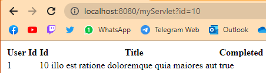

# Respuestas
## PARTE III
Con el método GET

Con el método POST

**Cambie el formulario para que ahora en lugar de POST, use el método GET. ¿Qué diferencia observa?**

Aunque los dos métodos son para enviar datos entre un cliente y servidor, la diferencia es que con el método GET los datos se envían a través de la URL por parámetros, en la imagen anterior se ve con ?id=10 donde se le envía 10 como parámetro para la id. Mientras que con el método POST se envían los datos en el cuerpo, lo cual significa que no se envían a través de la URL como se muestra en la primera imagen, haciéndolo un método más seguro.
**¿Qué está viendo?**
Se ve una tabla con la información de la tarea con la id dada en el formulario. La tabla esta se creó a través de la clase Service, primero obteniendo la información de la tarea con el método getTodo(int id) y después haciendo la tabla con el método todosToHTMLTable(List<Todo> todoList), la cual crea la tabla con la lista de tareas que se le da y cada fila la hace con el método todosToHTMLTable(List<Todo> todoList).
## PARTE IV
**Haga cinco intentos en uno, y luego un intento en el otro. ¿Qué valor tiene cada uno?**

Primero haré los cinco intentos en el computador local:

Se hacen un intento en otro computador:

El segundo computador inicia con los valores que se obtuvieron tras los 5 intentos que se hicieron en el otro, se hace un intento y se actualiza la página en el computador donde se hicieron los 5 intentos, los valores en ambos ahora son iguales.

**Reinicie la aplicación y repita el ejercicio anterior. ¿Coinciden los valores del premio?**

Ahora se vuelven hacer los 5 intentos pero con @SessionScoped

En el otro computador inicia desde 0, sin ningún intento.

No coinciden los valores del premio, el segundo computador inicia desde 0 intentos.

**Dado la anterior, ¿Cuál es la diferencia entre los backing-beans de sesión y los de aplicación?**

La anotación @SessionScoped se utiliza para indicar que un objeto debe durar mientras el usuario esté en una sesión. Cada vez que se inicie una sesión, se creará una única instancia del objeto, y cuando se cierre la sesión, se destruirá la instancia. Es decir, el objeto es específico para cada sesión del usuario y no se comparte con otras sesiones.
Por otro lado, la anotación @ApplicationScoped se utiliza para indicar que un objeto debe durar mientras la aplicación esté en funcionamiento. Se crea una única instancia del objeto que se comparte con todos los usuarios que utilizan la aplicación. La instancia del objeto se destruirá cuando se detenga la aplicación o se reinicie.

**Herramientas de desarrollador del explorador**

